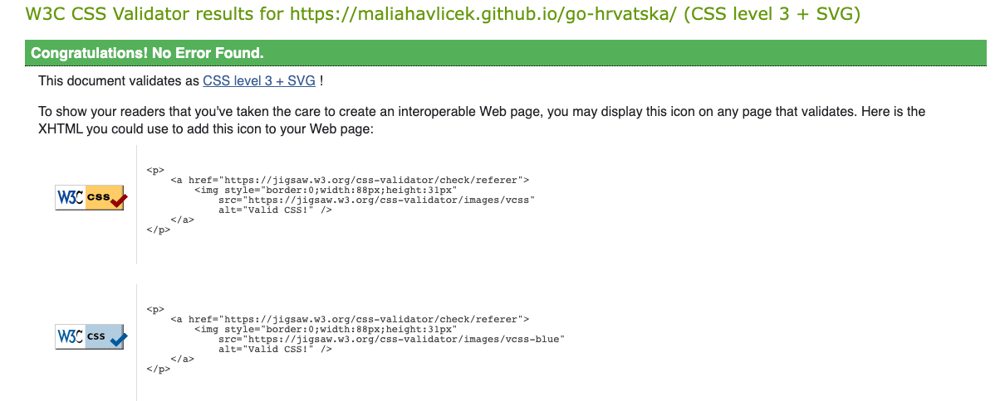
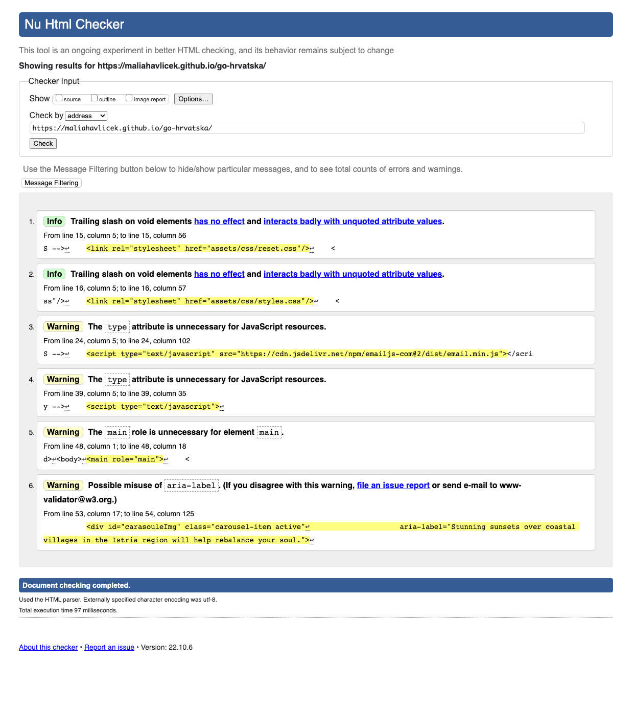

# OVERVIEW

This template was made as a guide to ensure you cover assessment criteria in your second milestone write up. It is specific to the **PORTFOLIO 1: HTML/CSS Essentials** project. It was based off the [loves running readme.md](https://github.com/lucyrush/readme-love-running#readme) with a few additions to help elevate you to possible distinction status.


Sections marked as 🚨**Required**  and 🚀 **merit & beyhond**

**Please note** that project assessment criteria changes more often than these guides are updated so double-check the submission criteria before assuming the  🚨**Required**  is all you have to do to pass.

## Helpful tools

Markdown's not all that easy so sometimes you may want to use some tools to make tables. 

- [Markdown Cheatsheet](https://guides.github.com/features/mastering-markdown/)
- [markdown table generator](https://www.tablesgenerator.com/markdown_tables) - used to help with documentation table formatting
- [mardown table of contents generator](https://ecotrust-canada.github.io/markdown-toc/) - used to create table of contents (be weary it does have some bugs if you have dashes or trailing spaces in your headers)
- [readme.so](https://readme.so/) - if you don't want to learn markdown, this tool might help you

# Table of Contents
Copy your readme to http://ecotrust-canada.github.io/markdown-toc/ to make a table of contents.  This will help assessors to see the structure of your readme. Just test it out ast this tool isn't perfect. It tends to mess up with special characters like dashes.

====================================== The Sections you Fill in are below with some instructions ==============================

# PROJECT NAME
🚨**Required** 

*replace the **PROJECT NAME** header with your project's name*
- One or two paragraphs providing an overview of your project.
- Write this as a sales pitch or commercial to entice users to interact with your site or how you want investors to purchase your website.
- Include a picture of site that shows it in responsive states and links to deployed code: https://ui.dev/amiresponsive

## Live Site
🚨**Required** 

- Include a link to deployed project (typically a GitHub Page on  github.io)

## Repository
🚨**Required** 

- Include a Link to the GitHub repository

## Author
🚨**Required** 

DEVELOPER_NAME (take credit for the work you do!)

## Table of Contents
🚀 **merit & beyond**

Generate after readme is complete by copying and pasting your readme from this point & below into this tool:
- [mardown table of contents generator](https://ecotrust-canada.github.io/markdown-toc/)
**NOTE:** It does have some bugs if you have dashes or trailing spaces in your headers

# UX
🚀 **merit & beyond**

This particular section can be blank, it's just a wrapper for the child sections.

The subsections provide insight into your UX process, focusing on why you made the user experience decisions you did. If the target audience and user base drove you to a certain look and feel call it out so the accessors can't be objective and say I don't like it. 

## Target Audience
🚀 **merit & beyond**

Your site is most likely geared to a certain audience, and your design choices should tie into them, pay attention to age groups, genders, demographics, & interests of the people you are hoping to use your site. If it's everyone, say so.


## Project Goals
🚀 **merit & beyond**

Write bullet points of what this site is trying to achieve.  
- This site presents X to Y with specific features.
- Another completely valid project goal is building your skill set with a focus on HTML and CSS :) 


## User Stories
🚀 **merit & beyond**

This section lists outs as a X I want Y, so I can Z format. It helps drive out the features you will build.

You can have many kinds of users so feel free to have one section or the subsections listed or more

### Site User
🚀 **merit & beyond**

### Website Owner
🚀 **merit & beyond**

### Developer
🚀 **merit & beyond**

## Design Choices
🚀 **merit & beyond**

Your site is most likely geared to a certain audience, and your design choices should tie into them. Let the assessors know your thought process.

You may want to re-watch the videos about the [5 planes of UX development ](https://learn.codeinstitute.net/courses/course-v1:codeinstitute+FE+2017_T3/courseware/22905698f3be425d918ebc64c87801b7/9c295bdc5a4048308460e262b14ab7df/) when writing up this section

### Colors
🚀 **merit & beyond**

- Discuss your color pallet choices and how it ties into users' emotions or target audience.
- include a screenshot of your pallet using a tool like [coolors.co](https://coolors.co/)

### Typography
🚀 **merit & beyond**

- discuss font size, font types for headers vs buttons vs general text and how it ties into users' emotions or target audience.
- include screenshots of fonts used and links to the appropriate website ex) https://fonts.google.com/specimen/Raleway

### Imagery
🚀 **merit & beyond**

Explain why you used certain icons and images on your site & tie it back into your target audience

### Animations and Transitions
🚀 **merit & beyond**

- discuss any special animations or transitions you've included 
- special hover state effects

## Site Structure
🚀 **merit & beyond**

Talk about if the site is 1 page vs multiple pages. Say what loads by default & how to get access to other pages/sections.

## Wireframes
🚀 **merit & beyond**

This section is also where you would share links to any wireframes, mockups, diagrams etc. that you created as part of the design process. These files should themselves either be included as a separate .md file, or open a pdf file in the project itself or screenshots in line.

Wireframes can be as simple as a picture of a drawing of how you envisioned laying out the information for you pages in desktop, tablet and mobile views. They are a roadmap and do not have to be 100% accurate of the final product. Or you can use the [Balsamiq](https://code-institute-room.slack.com/archives/C0L316Z96/p1640099614368000) tool that Code Institute provides students access to. 

## mobile
🚀 **merit & beyond**

## tablet
🚀 **merit & beyond**

## desktop
🚀 **merit & beyond**

# Features
🚨**Required** 

In this section, you should go over the different parts of your project, and describe each in a sentence or so and how they tie into  your user stories.

## Implemented Features
🚨**Required** 

It's easiest to break this section down into the header, footer, and each page/layer/signification section of your website. Call out any differences for mobile vs desktop presentations, include a screenshot of the implemented feature.

Don't forget your 404 error page.

For some/all of your features, you may choose to reference the specific project files that implement them, although this is entirely optional.

## Future Features
🚀 **merit & beyond**

Use this section to discuss plans for additional features to be implemented in the future

If you end up not developing some features you hoped to implement, you can include those in this section too.


## Testing
🚨**Required** 

In this section, you need to convince the assessor that you have conducted enough testing to legitimately believe that the site works well. Essentially, in this part you will want to go over all of your user stories from the Features section and ensure that they all work as intended, with the project providing an easy and straightforward way for the users to achieve their goals.

If this section grows too long, you may want to split it off into a separate file and link to it from here.

## Validation Testing
🚨**Required** 

In this section you should write up any websites you used to validate your code and include screenshots.

**Validation issues are an automatic failure** You should run these about 3 times:
- when you first deploy your site
- just when you think you are done testing
- right before you submit because 😼, ⚽, 🐶 & 👼 can eliminate a closing tag or curly bracket without you noticing.

### CSS Validation
🚨**Required** 

If you only have one CSS file used on all pages, you only need to run this once for your deployed url, but if you have different files for different pages, run it by direct input per file.

- include a screenshot for each CSS file which includes the Green no ERRORS bar,  two check marks

[CSS validator](https://jigsaw.w3.org/css-validator/)

**styles.css**


### HTML Validation
🚨**Required** 

If you only have one HTML file for your project, you only need to run this once for your deployed url, but if you have different files even for a thankyou or 404, run it by direct input per file or by deployed url per file.

- include a screenshot for each HTML file with the Blue Nu Html checker down to the blue checking complete bit. It's ok to have info and warnings. 
- You may need a scrolling screenshot to capture this one. I tend to use the [GoFullPage extension in chrome](https://chrome.google.com/webstore/detail/gofullpage-full-page-scre/fdpohaocaechififmbbbbbknoalclacl):

[HTML Validator](https://validator.w3.org/)

**index.html**


**404.html**


## Compatibility and Responsive Testing
🚨**Required** 

Minimally you should use dev tools and emulators to try to test you site on various screen sizes and browsers and note it in a table:

I ensured my site was worked well, and looked nice on a variety of devices & browsers as noted in the table below:

| TOOL / Device                 | BROWSER     | OS         | SCREEN WIDTH  |
|-------------------------------|-------------|------------|---------------|
| real phone: motog6            | chrome 78   | android 8  | XS 360 x 640  |
| browser stack: iPhone5s       | safari  13  | iOs        | XS 320 x 568  |
| dev tools emulator: pixel 2   | firefox  69 | android 8  | SM 411 x 731  |
| browserstack: iPhone 10x      | Chrome 78   | iOs 11     | SM 375 x 812  |
| browserstack: nexus 7 - vert  | Chrome 78   | android 7  | M 600 x 960   |
| real tablet: ipad mini - vert | safari  13  | iOs 6      | M 768 x 1024  |
| browserstack: nexus 7 - horiz | firefox 69  | android 7  | LG 960 x 600  |
| chrome emulator: ipad - horiz | safari 13   | iOs        | LG 1024 x 768 |
| browserstack windows PC       | Chrome 78   | windows 10 | XL 1920 x 946 |
| real computer: mac book pro   | safari 12.1 | Mohave     | XL 1400 x 766 |
| browserstack windows pc       | IE Edge 88  | windows 10 | XL 1920 x 964 |


🚀 **merit & beyond**
Document why you chose the devices:

1. Visit https://gs.statcounter.com/browser-market-share to figure out the most popular browsers & operating system combos seen across the web for the geographic region, and platoform(s) and screen sizes you expect your users to belong to. 

2. Include a sentence about why you chose the combinations you did.

3. Create a table that lists out what devices, browsers, and operating system you tested your application on and a brief description of why you chose the mixture you did. The point is to prove that you looked at the site across various browsers, operating systems, and viewport breakpoints.

4. if you can't find the browser/device/OS combinations you want on Browserstack with your github student webpack (or you didn't activate that in time), note what you'd ideally test on then what you ended up testing on as a compromise. 

5. Build a table to summarize the choices you made [markdown table generator](https://www.tablesgenerator.com/markdown_tables)

The combinations above were chosen because of the following information I gathered  from [ga.statcounter.com]( https://gs.statcounter.com/browser-market-share) for the US from Aug-Oct 2021:
**browser Version Market Share**:
  - safari iphone: 26.32%
  - chrome for android: 21.32%
  - Chrome 105.0: 15.77%
  - Chrome 104.0: 6.28%
  - Edge 105: 4.99%
  - Safari 15.6 3.76%
**browser Market Share**
  - chrome: 50.28%
  - Safari: 34.65%
  - Edge: 6.37%
  - Firefox: 3.52%
  - Samsung Internet: 2.04%
  - Opera: 0.89%
**platform breakdown**
  - mobile: 51.26%
  - desktop: 45.73%
  - tablet: 2.97%
  - console: 0.03%

## Manual Testing
🚨**Required** 

For any scenarios that have not been automated, test the user stories/features manually and provide as much detail as is relevant. A particularly useful form for describing your testing process is via scenarios in markdown such as:

**Manual Testing For Contact Form**
1. Contact form:
    1. Go to the "Contact Us" page
    2. Try to submit the empty form and verify that an error message about the required fields appears
    3. Try to submit the form with an invalid email address and verify that a relevant error message appears
    4. Try to submit the form with all inputs valid and verify that a success message appears.

Or you can use markdown check boxes and write them up per feature:

**Manual Testing For Contact Form**
- [x] try to submit 
- [x] Try to submit the empty form and verify that an error message about the required fields appears
- [x] Try to submit the form with an invalid email address and verify that a relevant error message appears
- [x] Try to submit the form with all inputs valid and verify that a success message appears.
- [x] no console errors
- [x] submit goes to code institute data dump page in new tab
- [x] looks good on mobile (one column)
- [x] looks good on tablet (two columns)
- [x] looks good on desktop (two columns but not SUPER HUGE)

Or you can use a spreadsheet
    
Here is a [Manual Testing Template](https://docs.google.com/spreadsheets/d/1vc1IVL-ydQwWeWMqnk_GRox6HE6qxDLpchGse8Crayo/edit#gid=296578096) that you can use as a starting point to keep track of your testing efforts. Make a copy of it in your own account and update as needed to reflect the browsers you are testing and features.  

It's ok to spot check specific functionality across devices and browsers but each page should be viewed as a whole for each device/browser combo at least once.

A quick way to check if items are exceeding the screen width of a project is to run this javascript in the console for various screen emulations:

```
var docWidth = document.documentElement.offsetWidth;
[].forEach.call(document.querySelectorAll('*'),function(el){if(el.offsetWidth > docWidth){console.log(el);}});
```

## Defect Tracking
🚀 **merit & beyond**

Try to create issues in real time as it better reflects the daily life of a developer.

The easiest way to track defects is by using GITHUB's Issues to track these as it's really easy to copy/paste screenshots in and then write up how you closed them. At this stage you don't need a custom template or labels, that comes in P4.

**Creating Defects**
1. Click the Issues menu item 


2. click the Green New Issue button


3. Fill in the default form

 - Fill in a descriptive title
 - add steps to reproduce if it's not straight forward
 - include a screenshot

4. click the submit New issue button

**Closing Defects**
1. Go to the issue list in GitHub and click on the issue you have fixed 


2. Add a brief write up of what you fixed and include a screenshot if necessary then Click the Close with Comment Button


**Reopening Defects**
1. If you find you didn't fix the issue, you can toggle to the closed items:


2. Click on the issue you want to re-open
3. Scroll down and click the re-open button


## Defects of Note
🚀 **merit & beyond**
Some defects are more pesky than others. Highlight 3-5 of the bugs that drove you the most nuts and link to them directly here. The accessors really like to know the struggle is real and that by doing this you picked up more skills.


## Outstanding Defects
🚨**Required** 

It's ok to not resolve all the defects you found as long as:
- it does not impact a user from completing a vital function on the website
- it only affects a very small subset of users
- is an extreme edge case that very few users would try
- there is an open issue against a framework, browser or technology used

If you know of something that isn't quite right, create an issue and link to it here and explain why you chose not to resolve it. 

Sometimes it's as simple, word wrapping issue that makes the site look odd at a certain screensize that you just didn't have time to fix due to the impending deadline it's best to mention it but note why you allowed it to go live: "Yes it looks odd, but it doesn't impact core functionality of the site." than to let the accessors think you didn't notice it. 

## Accessibility Testing
🚨**Required** 

Accessibility testing is aimed to make sure that those with visual or physical disabilities can still browse your website. Some users have had strokes or accidents that make it difficult to use a mouse, so they use keyboard keys to tab through sites. Others use screen readers that rely on HTML tags to help the user navigate quickly through the site to find information they want, others have color blindness or contrast issues. It's the law to provide services 
Here's a [site](https://www.w3.org/WAI/fundamentals/accessibility-intro/#:~:text=Accessibility%20is%20Important%20for%20Individuals%2C%20Businesses%2C%20Society,-The%20Web%20is&text=That%20is%2C%20the%20accessibility%20barriers,older%20people) where you can learn more about accessibility and the internet.

### Lighthouse Audits
🚨**Required** 
You should run your deployed website pages through lighthouse's audit to check performance, accessibility, best practices and SEO scores. You should aim to get 85 or higher score. 
https://web.dev/measure/  If you have lower scores, read the report and follow the links to address the flagged issues. You can run this tool from Chrome Dev Tools too against your local machine, but the performance will the worst (I personally ignore my performance results unless it's deployed code. I hope for > 60 on that mark, but > 85 on the other 3)

**You should fix issues associated with:**
- contrast 
- aria labels
- alt text
- large images
- skewed images

### Keyboard Navigation
🚀 **merit & beyond**
Another way to accessibility test you site is to try to click on the browser and see what happens if you use the tab, arrow and enter keys. Does it work well or does the user get stuck? Check this in a couple browsers as the focus & active outlines are typically styled by the browser

You can take a video of this testing if you want and convert it to a gif and paste that into your readme. Record somethign to yourself in slack, then download it and convert it at 


### Chrome Vox Reader
🚀 **merit & beyond**
If you are really ambitions you can use the VoxReader extension in chrome to see what your site sounds like to a screen reader. It really drives home the need for good aria-labels & semantic HTML.

# Technologies Used
🚀 **merit & beyond**

This section just summarizers tools and programming languages you used.

## Languages
🚀 **merit & beyond**

-write bullet points for the languages you used (HTML & CSS)

## Frameworks, Libraries & Programs Used
🚀 **merit & beyond**

List out the tools you used with a link and a short description (this helps others figure out where to get the bonus points & reminds you what you used for your next project
- Balsamiq
- Coolors.co
- fontawesome
- gitpod
- github
- google fonts
- font awesome
- amiresponsive
- table of contents creator
- markdown table generator


# Deployment
🚨**Required** 

This section should describe the process you went through to deploy the project to a hosting platform (e.g. GitHub Pages).

-Enumerate steps and use screenshots to make the instructions are clear.

You may want to re-watch the [initial deployment in gitpod video](https://learn.codeinstitute.net/courses/course-v1:CodeInstitute+LR101+2021_T1/courseware/4a07c57382724cfda5834497317f24d5/9b06129195c64fada6783de9cfe82d60/) when writing up this section.

## Deploy to GitHub Pages
🚨**Required** 
Write out steps you would take and test them to deploy your code to GitHub Pages, include screenshots if you think they would make the process easier.

## Forking The Repository
🚀 **merit & beyond**
A fork creates a completely independent copy of Git repository. In contrast to a fork, a Git clone creates a linked copy that will continue to synchronize with the target repository, so if you want to ensure other people don't commit to your public repo, you might want to tell them to fork the repository :) 

## Run Locally With GitPod
🚀 **merit & beyond**

Enumerate and write the steps of how to run a project locally via gitPod. Include Screenshots to maximize the impact of the instructions.

## Credits
🚨**Required** 

To avoid plagiarism amd copyright infringement, you should mention any other projects, stackoverflow, videos, blogs, etc that you used to gather imagery or ideas for your code even if you used it as a starting point and modified things. Giving credit to other people's efforts and ideas that saved you time acknowledges the hard work others did.  The accessors expect something here, there is no way you didn't have to get help on making such a nice project.

### Content
🚨**Required** 

Use bullet points to list out sites you copied text from and cross-reference where those show up on your site. If you truly are an expert in the content you provided, say that due to your exposure/experience of the topic covered, you created the content on your own.

### Media
🚨**Required** 

Make a list of sites you used images from. If you used several sites try to match up each image to the correct site. This includes attribution for icons if they came from font awesome or other sites, give them credit. If you took the images yourself, give yourself credit.

### Acknowledgments
🚀 **merit & beyond**

This is the section where you refer to code examples, mentors, blogs, stack overflow answers and videos that helped you accomplish your end project. Even if it's an idea that you updated you should note the site and why it was important to your completed project.

If you used a CodeInstitute Example project as a starting point. Make note of that here.


