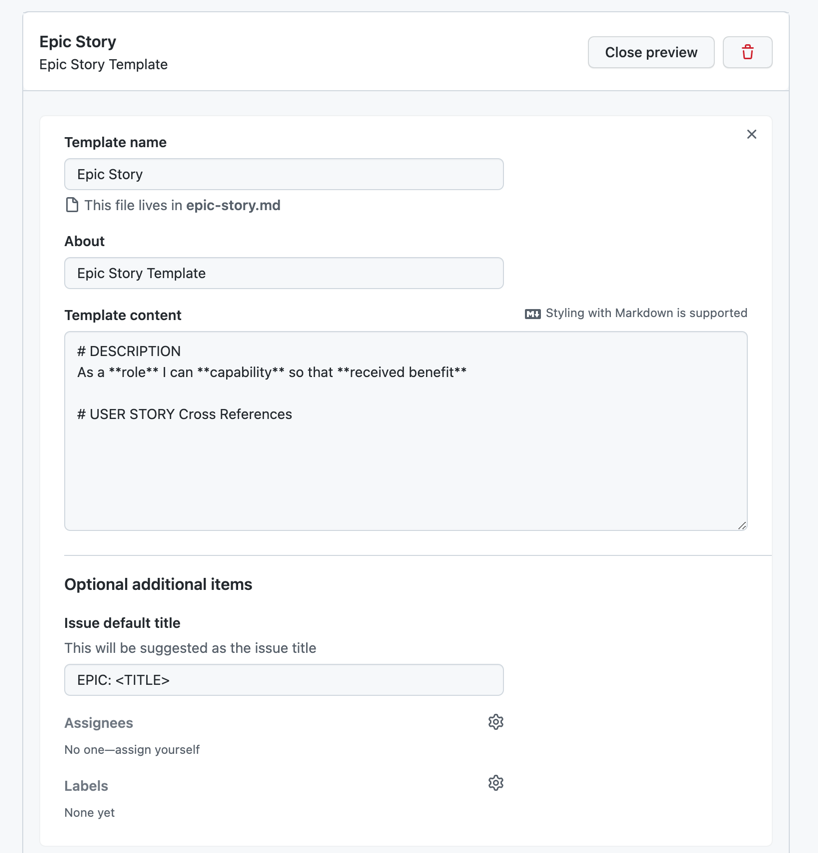
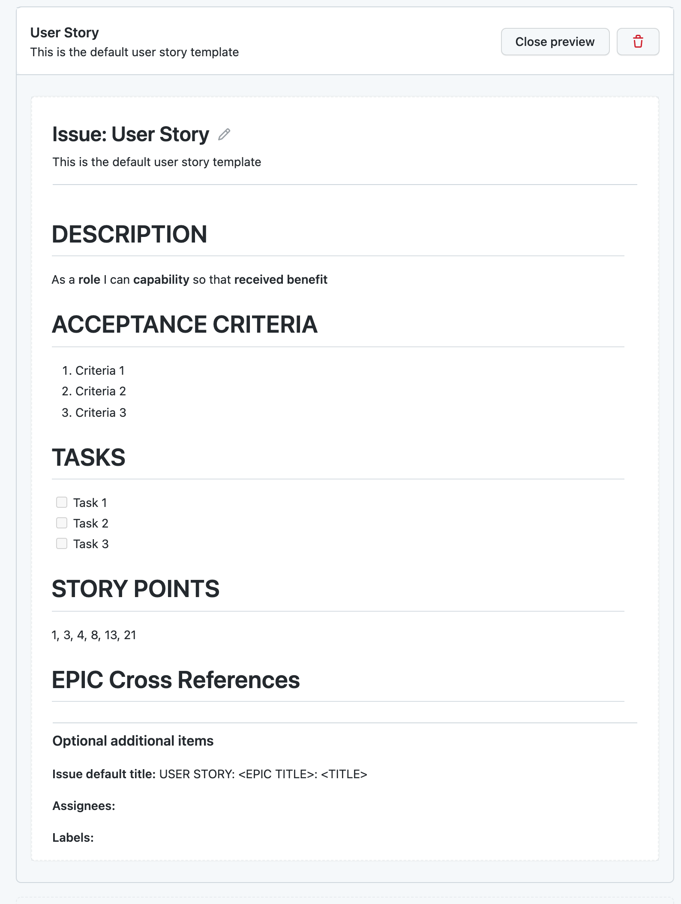

# PROJECT_NAME

*replace the **PROJECT NAME** header with your project's name*
- Screenshot of logo/navigation of mobile deployed site
- Include a link to deployed project with one line explanation of project

- (optional) Include a travis build status if you hooked up automated builds
[

## Author
DEVELOPER_NAME

## Project Overview
- Include a picture of site that shows it in responsive states and links to deployed code: http://ami.responsivedesign.is/
- One or two paragraphs providing an overview of your project.
- Write this as a sales pitch or commercial making users want to purchase your website.
- Include a link to your deployed website

### Design Choices
Your site is most likely geared to a certain audience, and your design choices should tie into them. Let the assessors know your thought process.

You may want to re-watch the videos about the [5 planes of UX development ](https://learn.codeinstitute.net/courses/course-v1:codeinstitute+FE+2017_T3/courseware/22905698f3be425d918ebc64c87801b7/9c295bdc5a4048308460e262b14ab7df/) when writing up this section

#### Colors

- Discuss your color pallet choices and how it ties into users' emotions or target audience.
- include a screenshot of your pallet using a tool like coolors.co

#### Typography

- discuss font size, font types for headers vs buttons vs general text and how it ties into users' emotions or target audience.
- include screenshots of fonts used and links to the appropriate website ex) https://fonts.google.com/specimen/Raleway

#### Images

Explain why you used certain icons and images on your site

#### Design Elements

- list out the type of elements you want to use on your site, this will help you  when choosing a framework and goes hand in hand when doing the wireframes. If you did something out of the ordinary, or think something was particularly clever, add a sentence and a screenshot or reference the file the code or css is in.

> - desktop navigation
> - mobile navigation
> - footer
> - containers/cards
> - buttons
> - text input
> - textarea inputs
> - dropdowns
> - modals/layers
> - check boxes
> - switches
> - accordions/drawers
> - pagination
> - date pickers
> - maps
> - images
> - tooltips
> - icons
> - tabbed content
> - file pickers
> - video players
> - audio players

#### Animations and Transitions

- discuss any special animations or transitions you've programmed 
- special hover state effects

#### Custom Styles
- call out any overrides you did for bootstrap styles even if they are fonts and colors, perhaps lead assessors to the file of interest in your repo 

#### Custom Javascript
- call attention to any custom javascript you created to help your User Experience you can organize this by functions or files

### Wireframes

This section is also where you would share links to any wireframes, mockups, diagrams etc. that you created as part of the design process. These files should themselves either be included as a pdf file in the project itself (in a separate directory), or  hosted elsewhere online and can be in any format that is viewable inside the browser.

- You should minimally have wireframes for desktop and mobile. Adding a Tablet view

[Back To Table of Contents](#table-of-contents)

## Agile Process

### User Stories

You should be using Git Hub Issues to write your user stories.  To get to merit levels you need to show you have refined stories from Epics to Generic User stories.

[Here's the lesson](https://learn.codeinstitute.net/courses/course-v1:CodeInstitute+AG101+2021_T1/courseware/a4e548ca70) on how to create a User Story Templates. 

If you want a chance at **DISTINCTION**, I'd suggest the following:
- Create an Epic Story template, this would have a title, the story and children stories
- Create a User Story template, this would initially have the title, the story, and a link to the Epic. Then you'd come back when you are prioritizing it to include the acceptance criteria, and story points, then again when you are working on it and fill in the tasks and adjust the story points if needed.
- Name your stories in a way that it's easy to tie the children to the EPICS by name.

Example: 
EPIC: Navigation
As a user, I want to have easy to see navigation on the page, so I can intuitively interact with the site without getting frustrated.

USER STORY: Navigation: Create Template
As a developer, I don't want to have copy and paste my navigation on every page. I want to use a template to house this information, so my code is easier to maintain.

USER STORY: Navigation: Desktop
As a user I want clear navigation that is up to industry standards for my desktop experience, so I can easily find what I need on a website.

USER STORY: Navigation: Mobile
As a user I want clear navigation that is up to industry standards for my mobile experience, so I can easily find what I need on a website without the navigation taking up the entire screen.

#### EPIC Stories

I created epic stories for the main features and page components used on  my website.  To better manage things I prefixed my epic stories with EPIC To make my life easier I created a custom issues template for Epic Stories: 

You can decide if you want to have any acceptance Criteria or not for Epic stories. 

Tell the assessors where they can find your epic stories and call out the 

- Link to Epic Milestone
- link to Issues
- link to Epic Story Template

#### Child Stories

After creating the epic stories or main features for my website, I created user stories that could be story pointed and tasked to help keep me feel like I was making progress, plus it shows I tried to follow the Agile Process. To manage these better I included the EPIC story name in my Title.

You can find my user stories by either looking at issues that are prefixed with USER STORY, or look at my milestone for  USER Stories.

- Link to Issues
- Link to User Stories Milestone
- Link to User Story Template

### Product Backlog
https://learn.codeinstitute.net/courses/course-v1:CodeInstitute+AG101+2021_T1/courseware/a4e548ca70a3473aa890ba2ab9bf612c/085f3a8e344a4cf28b5b5355399abcc1/?child=last
This is the MILESTONE where you grab stories from the issues or USER stories you created and prioritize them  and order them.

Include a link to your Product Catalog Milestone

## Labels

Must haves
Could Have

### Iterations
https://learn.codeinstitute.net/courses/course-v1:CodeInstitute+AG101+2021_T1/courseware/a4e548ca70a3473aa890ba2ab9bf612c/71fe6c52cccf477688e924c9889f5fec/?child=first

Add links to iteration milestones

### Progress Boards
https://learn.codeinstitute.net/courses/course-v1:CodeInstitute+AG101+2021_T1/courseware/a4e548ca70a3473aa890ba2ab9bf612c/7ad7f487cc6148ecb182d77feaeda269/?child=first
Add links to Progress boards
